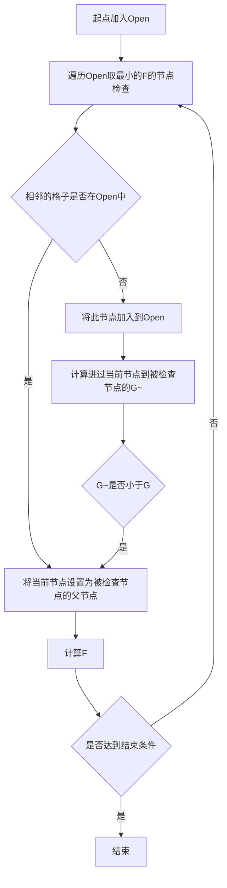

# A*算法的基本原理

## 用图的形式表现地图

这里说到的图是graph,而不是map,图(graph)是由一系列的节点和连接节点的边来描述的一种模型.我们使用graph来描述代价地图的时候,只需要把地图中的位置转化为graph中的节点,用连接关系代表位置之间的可到达性,这样以来,在进行A* 算法的时候就可以直接对图(graph)进行操作,而完全抛弃原来的几何地图.
在A* 算法的实现中,是这样将地图(map)转化成图(graph)的:
* 首先,定义节点
```c++
typedef struct
{
    int x, y;
    unsigned char reachable, sur, value;
} MapNode;
```
节点中包括该点在地图中的坐标(x,y),地图到相邻点的可到达性(reachable),在代价地图中是否被占用(value).
* 定义图graph
```c++
static MapNode graph[Height][Width];
```
各节点之间的连接关系是通过每个节点的可达性(reachable)表示的.
* 将地图Map表示成图Graph的形式通过以下代码实现

```c++
void initGraph(const int map[Height][Width], int sx, int sy, int dx, int dy)
{    //地图发生变化时重新构造地
    int i, j;
    srcX = sx;    //起点X坐标
    srcY = sy;    //起点Y坐标
    dstX = dx;    //终点X坐标
    dstY = dy;    //终点Y坐标
    for (i = 0; i < Height; i++)
    {
        for (j = 0; j < Width; j++)
        {
            graph[i][j].x = i; //地图坐标X
            graph[i][j].y = j; //地图坐标Y
            graph[i][j].value = map[i][j];
            graph[i][j].reachable = (graph[i][j].value == Reachable);    // 节点可到达性
            graph[i][j].sur = 0; //邻接节点个数
            if (!graph[i][j].reachable)
            {
                continue;
            }
            if (j > 0)
            {
                if (graph[i][j - 1].reachable)    // left节点可以到达
                {
                    graph[i][j].sur |= West;
                    graph[i][j - 1].sur |= East;
                }
                if (i > 0)
                {
                    if (graph[i - 1][j - 1].reachable
                        && graph[i - 1][j].reachable
                        && graph[i][j - 1].reachable)    // up-left节点可以到达
                    {
                        graph[i][j].sur |= North_West;
                        graph[i - 1][j - 1].sur |= South_East;
                    }
                }
            }
            if (i > 0)
            {
                if (graph[i - 1][j].reachable)    // up节点可以到达
                {
                    graph[i][j].sur |= North;
                    graph[i - 1][j].sur |= South;
                }
                if (j < Width - 1)
                {
                    if (graph[i - 1][j + 1].reachable
                        && graph[i - 1][j].reachable
                        && map[i][j + 1] == Reachable) // up-right节点可以到达
                    {
                        graph[i][j].sur |= North_East;
                        graph[i - 1][j + 1].sur |= South_West;
                    }
                }
            }
        }
    }
}
```
这样以来,我们可以完全抛弃之前的地图的概念,不去考虑地图几何特征,也可以抛开距离长度等要素,而是直接对图Graph进行操作.
## Openlist和Closelist
A* 算法是一种基于搜索的路径规划算法,在进行搜索的时候,我们期望有一个"域"来限定我们的搜索范围,以免工作量过大限制效率,也就是说我们希望知道哪些节点是有必要搜索的,哪些节点是不需要搜索而直接忽略的.所以在A* 算法中定义了Openlist来限定需要搜索的节点范围,定义了Closelist用来忽略不需要处理的节点,也就是说,我们每检查一个节点,这个节点必然是在Openlist中而当一个节点在Closelist中时,我们可以跳过检查的步骤,而去考虑其他节点.当然Openlist和Closelist是持续修订的,当我们进入一个区域的时候,会加入应该被搜索的节点到Openlist中,而我们检查过的节点则应该放到Closelist中.
* A* 中这样定义的Openlist
```c++
typedef struct //优先队列（Open表）
{
    int length;        //当前队列的长度
    Close* Array[MaxLength];    //评价结点的指针
} Open;
```
* Closelist的定义为
```c++
typedef struct Close
{
    MapNode *cur;
    char vis;
    struct Close *from;
    float F, G;
    int H;
} Close;
```
在Closelist中包含着被检查节点的信息,所谓被检查节点的信息,就是我们搜索到某个节点的时候对其进行"检查",这种"检查"是指:
* 1.判断该节点是否可以被访问
* 2.计算该节点的估价函数
```math
F=G+H
```

这里的G是指沿着历史规划路径走到被检查节点的代价,H是指被检查节点到目标点的预估代价.
在A* 算法中,我们抛弃了原来的长度信息,而是用图Graph节点之间的关系来带替,所以我们计算机器人在节点之间运动用代价来衡量,这个代价我们可以自己定义,比如说节点之间横向和纵向平移一个节点,我们用代价1来表示,沿斜线运动一个角度我们用1.41来表示代价,坐45度转向我们用代价0.1表示,90度用0.2,135度用0.5.而被检查节点到目标点的预估我们通常用曼哈顿距离来表示.
## 搜索过程
有了图Graph的概念和Openlist以及Closelist后,我们就可以通过搜索的方式进行路径规划了.

首先,把起点加入Openlist,重复以下步骤:

* 遍历Openlist,找到F值最小的节点,把它作为当前处理的节点,并把该节点加入Closelist中

* 对该节点的8个相邻格子进行判断,如果格子是不可抵达的或者在Closelist中,则忽略它,否则如下操作:

    a. 如果相邻格子不在Openlist中,把它加入,并将From设置为该节点和计算f,g,h值

    b.如果相邻格子已在Openlist中,并且新的G值比旧的G值小,则把相邻格子的From设置为该节点,并且重新计算f值.

直到终点加入了Openlist中,表示找到路径;或者Openlist空了,表示没有路径,循环结束.

如果开启列表已经空了,说明路径不存在.

最后从目标格开始,沿着每一格的父节点移动直到回到起始格,这就是路径.



